# cc_debuger_realtime

cc_debuger_realtime 是一款针对 Cocos Creator 项目（目前支持 3.x 版本）的调试工具，能够显著提高开发和调试效率。无论是开发版还是发布版，支持 Android、iOS、Web、小程序等多种平台，提供包括但不限于以下功能：

- 实时查看节点树、实时修改节点或组件属性
- 实时统计节点（或递归子节点）依赖的资源列表
- 实时查看内存中的资源、引用计数、依赖情况
- 实时查看内存中的动态图集
- 支持动态注入执行js脚本，并获取返回值
- 支持拦截并显示运行时日志
- 支持查看可写目录的文件结构，并支持下载文件到PC端预览（仅native）
- 实时预览或切换spine、dragon、cc.Animation的动画
- 打开或关闭FPS预览

## 插件原理
本插件分为3个部分：
   - **插件客户端：** 插件的 UI 界面，包含一个 WebSocket 客户端。 
   - **插件中转服务器：** 基于 Go 编写的 WebSocket 服务器，核心代码编译为 WASM，用于插件客户端和运行时客户端之间的数据交互。
   - **运行时客户端：** 即您的游戏，加载插件时会自动引入两个 TypeScript 文件，包含 WebSocket 客户端，用于与插件交互。

通过插件中转服务器，您可以在插件 UI 上实时查看和操作游戏运行时的信息。如果将插件服务器部署到远程，还可以对线上客户端进行实时调试。

## 安装与配置

1. **安装插件**
   - 1.将插件下载后，放置在 Cocos Creator 根目录下的 extensions 文件夹中，并命名为 cc_debuger_realtime。
   - 2.如果不是从 Cocos Store 下载，请执行以下命令安装依赖：
      ```shell
      npm install
      ```
2. **启用插件**
   - 打开 Cocos Creator 编辑器，进入扩展管理，启用该插件，点击刷新。
   - 插件已启用后，在编辑器菜单页找到 **扩展 -> 节点&资源-实时调试** ，点击即可打开插件主界面
   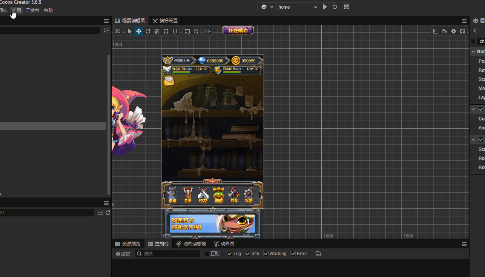

3. **项目设置**：
   - **启用 WebSocket** 确保在项目设置的功能裁剪中勾选 WebSocket，否则构建后的程序将无法连接插件。

## 文件夹结构
```text
cc_debuger_realtime/
├── builder/
├── dist/
├── i18n/
├── runtime/
│   ├── cc_debuger_1.ts
│   └── cc_debuger_2_ugly.ts
├── server/
│   ├── wasm/
│   │   ├── go_init.cjs
│   │   └── wasm_exec.cjs
│   ├── server.js
│   └── server.wasm
├── package.json
└── version.txt
```

### 各文件夹作用如下：
- **builder**：干预构建流程

   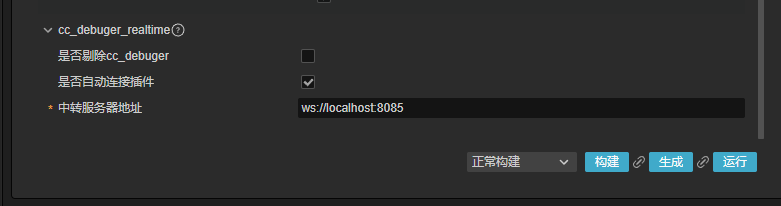
   - 如果勾选“剔除cc_debuger”,则构建前会删除掉assets/cc_debuger_1.ts和assets/cc_debuger_2_ugly.ts，客户端不再具备与插件交互的能力；
   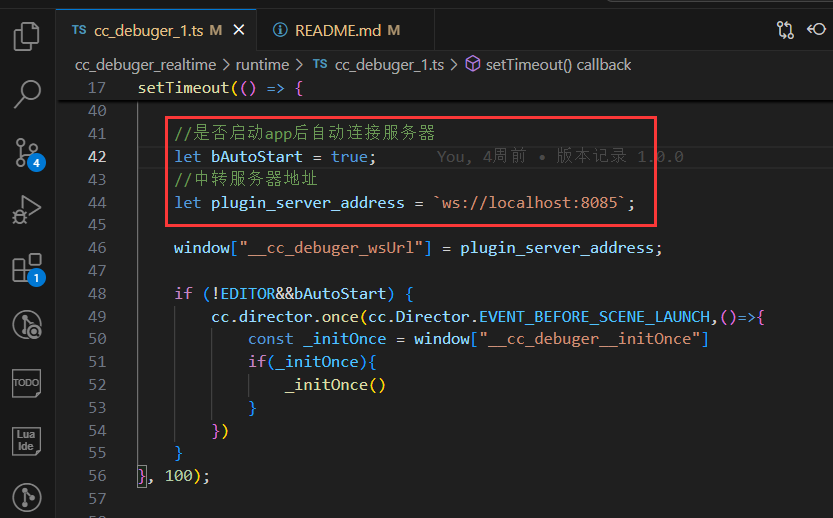
   - "自动连接插件"、“中转服务器”，是在构建前修改cc_debuger_1.ts的内容，
   一般来说，发布到线上的产品，不要勾选"自动连接插件"，应该主动在合适的机会，手动调用如下代码：
      ```js
      //此初始化函数定义在cc_debuger_2_ugly.ts中，调用了这个，才能正常连接插件服务器
      const _initOnce = window["__cc_debuger__initOnce"]
      if(_initOnce){
            _initOnce()
      }
      ```
   - “中转服务器”即插件服务器的websocket地址，格式为 ws://{ip}:{host}
   - 注意，运行时客户端和插件客户端，必须连接同一个插件服务器。运行时客户端可以手动修改cc_debuger_1.ts中的plugin_server_address的值；插件客户端中可以在UI中切换,点击切换、输入新的地址、回车：
   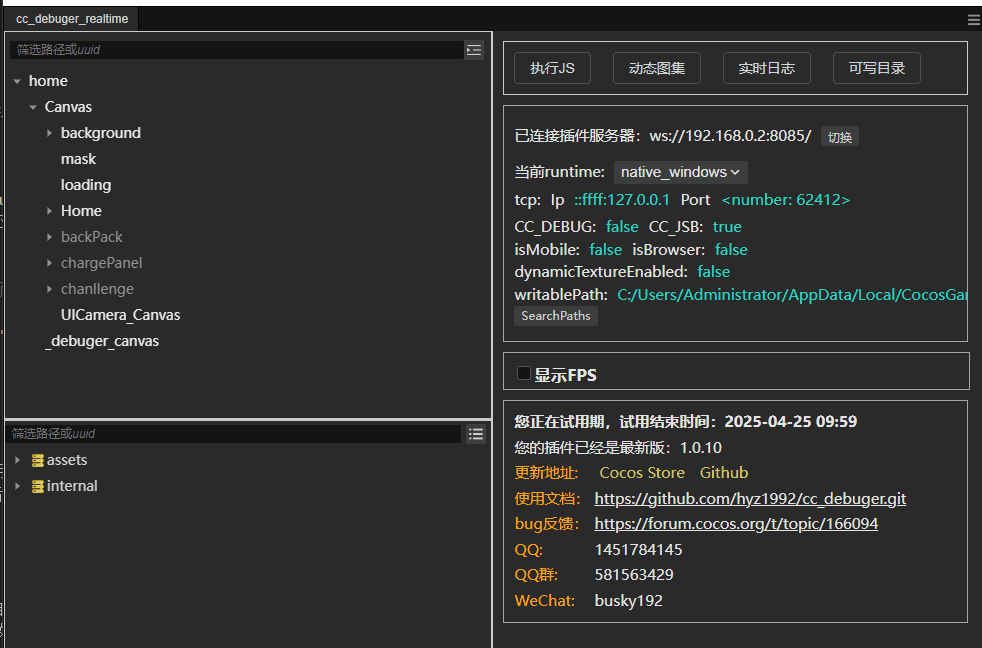

- **dist** 插件UI和主要逻辑代码都在这，已混淆过
- **i18n** 多语言配置
- **runtime** 此文件夹内的两个文件，会在加载插件的时候自动复制到assets目录下，里面包含一个websocket客户端，用于与插件交互各种运行时数据，如节点树、资源使用情况、自动图集、FPS帧率、注入js代码等
- **server** 这里是插件服务器，其中server.wasm是go语言编写的服务器核心代码，此服务器作为中转，辅助插件客户端和运行时客户端(即您的游戏)进行交互。
   - 插件主界面打开的时候，会自动运行此服务器，一般情况下，地址是ws://localhost:8085
   - 您也可以手动运行服务器，只需要使用nodejs执行如下命令 
      ```shell
      
      node server.js 8888
      ```
   - 注意，当手动复制server文件夹到别处时，需要先cd到server目录并执行npm install ws ， 执行之后，会在当前文件夹生成package.json，package.json中要加上"type":"module"，不然会报错：SyntaxError: Cannot use import statement outside a module
      ```js
      {
        "dependencies": {
            "ws": "^8.18.1"
         },
        "type":"module"
      }
      ```
   这就会在本地的8888端口开启一个中转服务器，当您把它部署到远程，即是远程服务器，您可以在插件主界面上切换到此服务器。
- **package.json** 插件的清单配置和nodejs依赖等
- **version.txt** 记录插件的版本号


## 功能演示

### 1. 实时查看节点树


### 2. 实时修改节点信息
支持修改节点坐标、缩放等，也支持修改任意组件的任意信息，如color、string、label

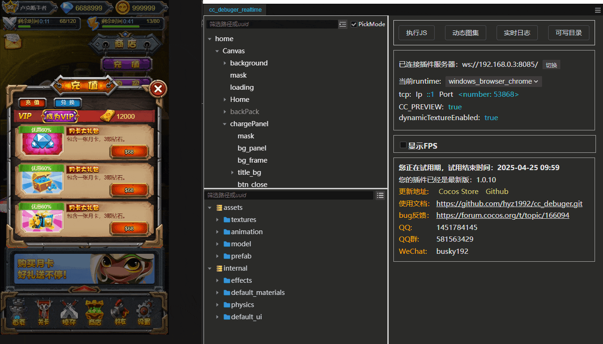

### 3. 查看节点依赖的资源列表
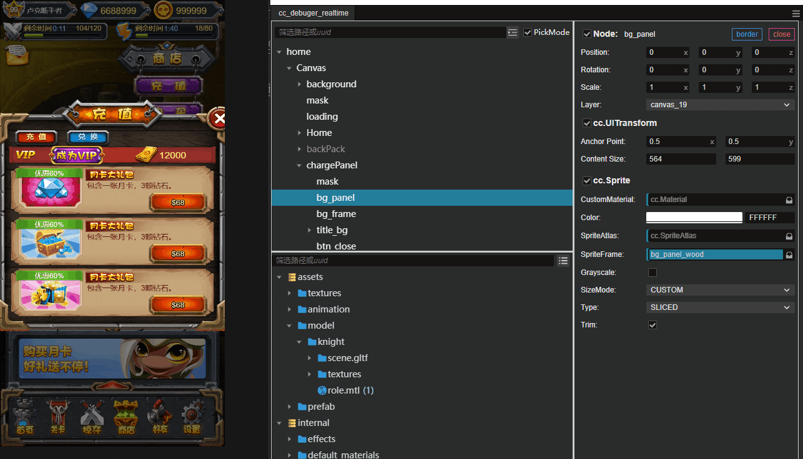

### 4. 动态图集
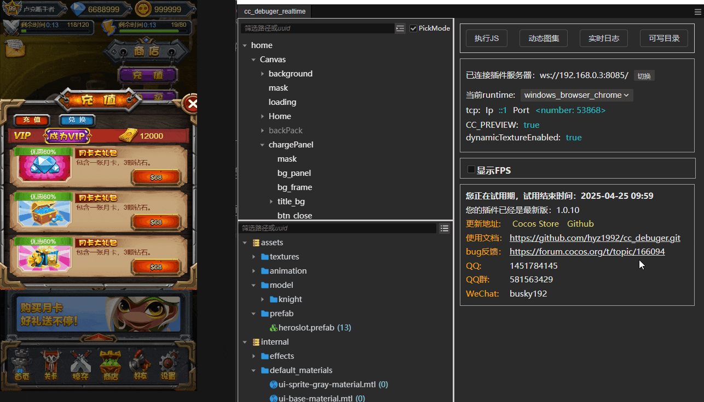 

### 5. 查看引用资源的节点
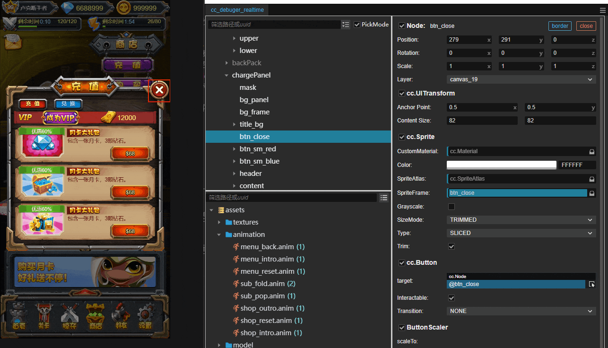 

### 6. 执行js脚本
可以修改运行时内存的信息：
```js
const _node = scene?.getChildByPath("Canvas/loading");
_node.active = false
```
也可以获得运行时内存中的信息：
```js
const scene = cc.director.getScene();
return scene.name
```

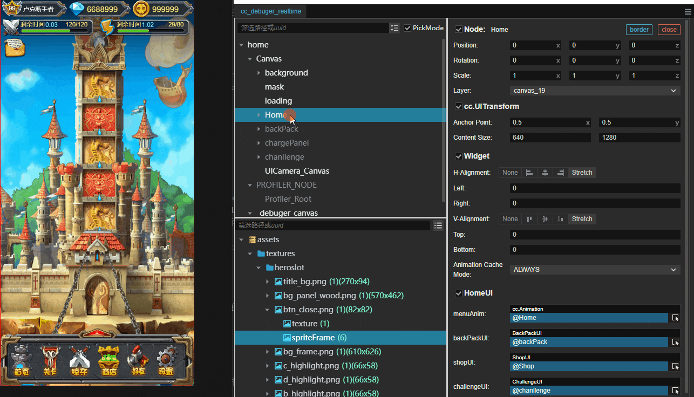

### 7. 拦截日志
注意，已构建发布的release运行时，cc.log、cc.warn无法拦截，只能拦截cc.error和console日志

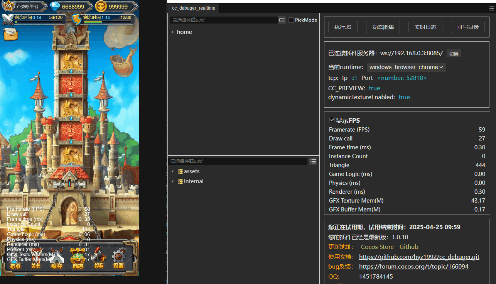

### 8. 切换spine动画
除了spine，还支持预览切换dragon、cc.Animation动画

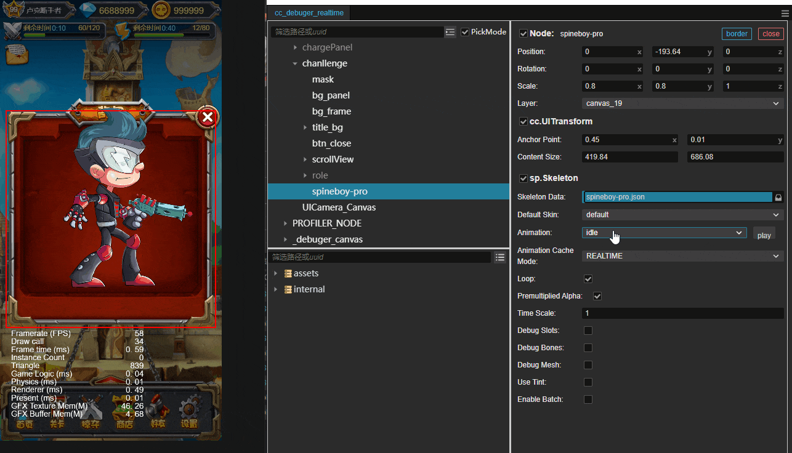

### 9. 查看可写路径
所有的native运行时都支持查看可写路径（native.fileUtils.getWritablePath()），并下载手机可写路径内的文件到本地，此处以windows为例。

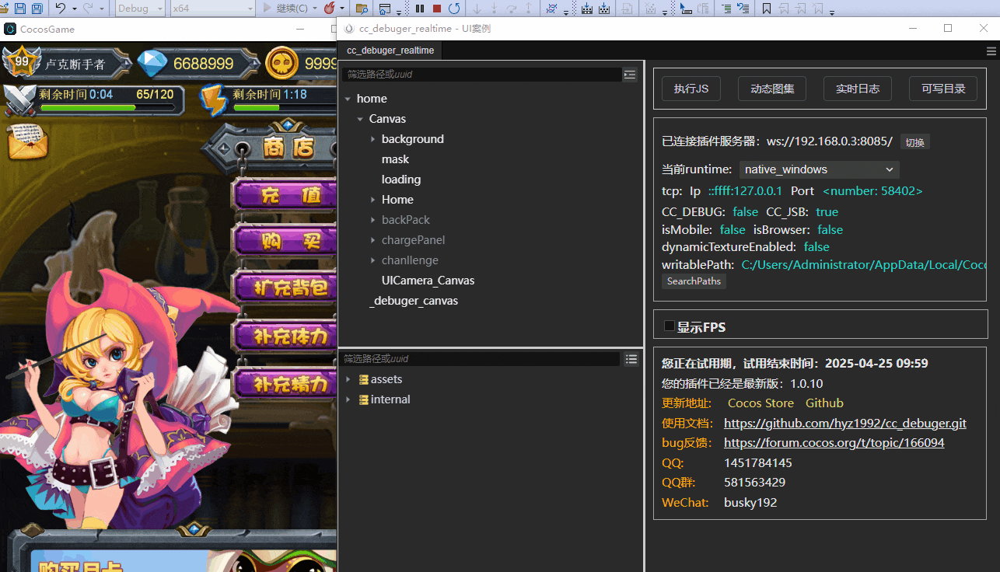


## 价格与试用
- 每个用户享有暂定7天的免费试用期，试用期间可使用全部功能。
- 试用期结束后，可通过激活码充值继续使用：
   - **90 天激活码：** 120 元
   - **永久激活码：** 220元

您如发现新的Bug，可通过论坛或 QQ 群反馈，确认无误后将免费发放激活码。
- [论坛地址](https://forum.cocos.org/t/topic/166094)
- [cocos商城地址](https://store.cocos.com/app/search?name=%E8%8A%B1%E5%A4%A9%E7%8B%82%E9%AA%A8)
- [github地址](https://github.com/hyz1992/cc_debuger)